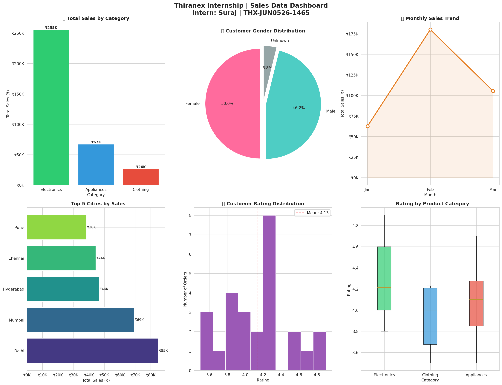

# 📊 Data Cleaning & Visualization Project
### Thiranex Internship | Task 1
**Intern:** Suraj &nbsp;|&nbsp; **ID:** THX-JUN0526-1465 &nbsp;|&nbsp; **Role:** Data Science Intern

---

## 📌 Project Overview

This project was completed as part of the **Thiranex Data Science Internship (June 2026)**. The goal was to take a raw, messy dataset, clean it using Python, and extract meaningful insights through visualizations.

---

## 📁 Files in This Repository

| File | Description |
|------|-------------|
| `sales_data.csv` | Raw e-commerce sales dataset (intentionally messy) |
| `data_cleaning_visualization.py` | Python script for cleaning + visualization |
| `sales_dashboard.png` | Final output dashboard with 6 charts |
| `README.md` | Project documentation (this file) |

---

## 🗂️ Dataset Description

A simulated Indian e-commerce sales dataset with **33 records** and **12 columns**, containing real-world data quality issues:

| Column | Description |
|--------|-------------|
| Order_ID | Unique order identifier |
| Customer_Name | Name of the customer |
| Age | Customer age |
| Gender | Customer gender |
| Product | Product purchased |
| Category | Electronics / Clothing / Appliances |
| Quantity | Number of items ordered |
| Price | Price per unit (₹) |
| Total_Sales | Total order value (₹) |
| City | City of the customer |
| Order_Date | Date of order |
| Rating | Customer rating (1–5) |

---

## 🧹 Data Cleaning Steps

### Problems Found in Raw Data:
- ❌ **2 missing values** in `Age` column
- ❌ **1 missing value** in `Gender` column
- ❌ **3 missing values** in `Rating` column
- ❌ **1 duplicate row**
- ❌ **Negative Age value** (-5) — impossible in real life
- ❌ **Extreme price outlier** (₹9,99,999) — data entry error

### Solutions Applied:
| Issue | Fix Applied |
|-------|-------------|
| Missing Age | Filled with **median age** |
| Missing Gender | Filled with `'Unknown'` |
| Missing Rating | Filled with **mean rating** |
| Duplicate rows | Dropped duplicates |
| Negative Age | Removed invalid rows |
| Price outliers | Removed using **IQR method** |
| Data types | Converted `Order_Date` to datetime, `Age` to int |

**Result:** Cleaned dataset with **26 valid rows** ready for analysis.

---

## 📊 Visualizations Created

The dashboard (`sales_dashboard.png`) contains 6 charts:

1. **Bar Chart** — Total Sales by Product Category
2. **Pie Chart** — Customer Gender Distribution
3. **Line Chart** — Monthly Sales Trend
4. **Horizontal Bar** — Top 5 Cities by Sales
5. **Histogram** — Customer Rating Distribution
6. **Box Plot** — Rating by Product Category



---

## 💡 Key Insights

| # | Insight |
|---|---------|
| 1 | 🏆 **Electronics** is the top-performing category |
| 2 | 🏙️ **Delhi** generates the highest sales among all cities |
| 3 | 📱 **Phone** is the best-selling product |
| 4 | ⭐ Average customer rating is **4.13 / 5.0** |
| 5 | 📦 Total valid orders after cleaning: **26** |
| 6 | 💰 Total revenue after cleaning: **₹3,48,100** |

---

## 🛠️ Tech Stack


```
Python 3.x
├── pandas      → Data loading, cleaning, manipulation
├── matplotlib  → Chart creation
└── seaborn     → Styled visualizations
```

---

## ▶️ How to Run

```bash
# 1. Clone this repository
git clone https://github.com/YOUR_USERNAME/thiranex-internship-task1.git
cd thiranex-internship-task1

# 2. Install required libraries
pip install pandas matplotlib seaborn

# 3. Run the script
python data_cleaning_visualization.py
```

The script will print step-by-step output and save `sales_dashboard.png`.

---

## 🎓 Learning Outcomes

Through this project, I learned:
- How to identify and handle **missing values, duplicates, and outliers**
- How to use **Pandas** for data manipulation
- How to create **multiple chart types** using Matplotlib and Seaborn
- How to **tell a story with data** through a structured dashboard
- The importance of **data quality** before analysis

---

## 🏢 About This Internship

**Organization:** [Thiranex](https://www.thiranex.in) — Skill Development & Future Tech  
**Duration:** 05 June 2026 – 04 July 2026  
**Mode:** Remote / Project-Based  
**Mentor Contact:** thiranex.internships@outlook.com

---

